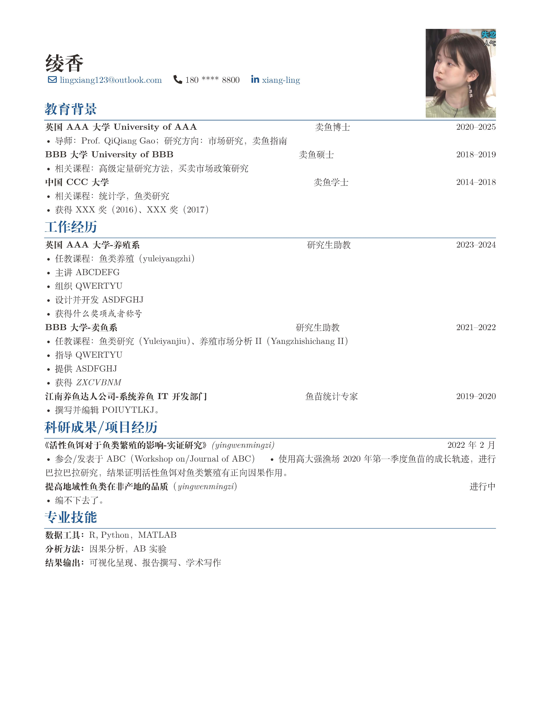

# Academic Resume in LaTeX

This repository contains my academic CV written in LaTeX. The formatting and layout are custom-built with inspiration from various open-source LaTeX resume templates.

- Author: WZZ2025
- Language: Chinese and English bilingual
- Tools: XeLaTeX, `ctex`, `graphicx`, `titlesec`, and other packages

## Preview

[Download PDF](./resume.pdf)

## License

This project is released under the MIT License. You are welcome to use, modify, and distribute it with attribution.
